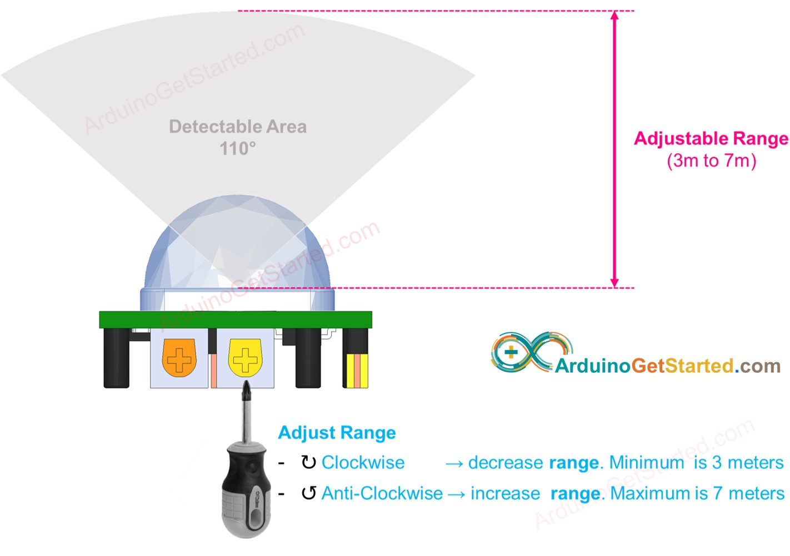
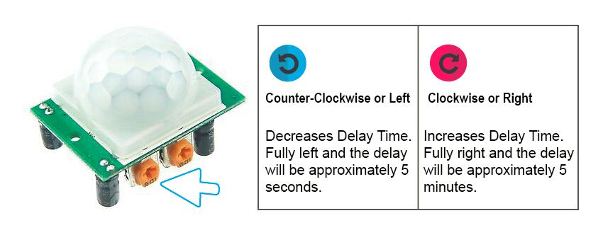
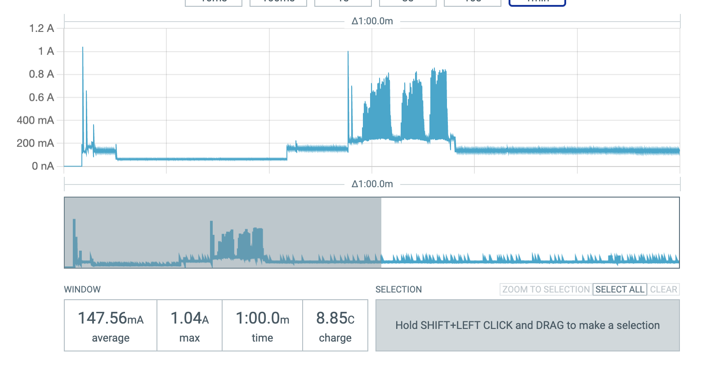
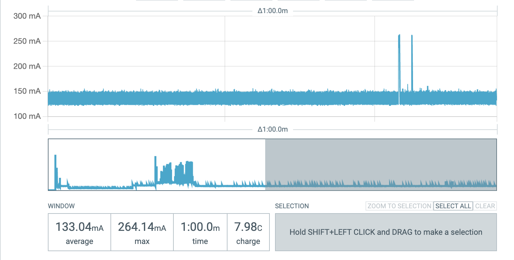

# TinyScrubCAM

## What is TinyScrubCAM?

The main purpose of tinyScrubCam is to allow for rapid detection and alert of species of interest ob a low power device that can transmit information about what it sees when it sees it. There are two versions of this device, 1 with a deterrent, and 1 without a deterrent. The deterrent aspect will play a loud noise from a speaker when a species of interest is detected in hopes of shooing the animal away from protected lands or areas with humans. The non-deterrent version will simply send an alert over LoRa if the animal of interest was seen. The deterrent version does this as well, just with the addition of the sound playing. The purpose of both of these devices is to fill the gap where cellular enabled cell cameras cannot, and ideally decrease the man-power required to monitor protected areas of interest. The current models available for tinyScrubCam were created on EdgeImpulse and can detect either rhinos or mountain lions, but any custom-trained EdgeImpulse model can also be used. These devices can be solar powered for continuous monitoring or used with a battery for a shorter duration. LoRa gateway coverage is needed to recieve the detection alerts. If you have an EarthRanger instance, there are tools for integrating the device alerts onto your instance so you can see the data in real time, where the detection happened. The current device is used during the daytime, but there is an IR version currently undergoing testing and development that will enable detections to continue through the night.

## Materials (alert-only)
Feather M0 with RFM95 (Adafruit|https://www.adafruit.com/product/3178?utm_sourceyoutube&utm_mediumvideodescrip&utm_campaignnewproductsCartoon&gad_source=1&gclid=Cj0KCQjwz7C2BhDkARIsAA_SZKZCIGn54L61ULlrLxffnhwh_xx6Jt_kOjqM2qmDKK6bbU3X-suS_-YaAo5ZEALw_wcB)


## Materials (deterrent + alert)

## Clone the Repository

Begin by cloning the TinyScrubCam repository to your local machine (currently in a branch since it is not merged with main):

```
git clone https://github.com/conservationtechlab/tinyscrubcam.git
```

## Set Up Instruction

1. Install Arduino IDE -- tested on Arduino 1.8.19
2. Install Adafruit Featherboards driver

- Open Preferences or Settings
- Copy paste this --> https://adafruit.github.io/arduino-board-index/package_adafruit_index.json
- Open Boards Manager
- Search Adafruit Feather M0
- Install the board library

3. Install MCCI LoRaWAN LMIC library by IBM
4. At time of writing it is at version 4.1.1 (May 31, 2024)
5. In the MCCI config file make sure to change it to the correct region, it is US915 by default.
6. Setup complete!

# MCCI Library is needed for compiling for the featherboard/lora, you need to delete this library and swap it with the esp32cam library to be able to upload to the esp32cam

## How to run?

This is the ESP32CAM version, utilzing an Adafruit Feather M0 Board to communicate over LoRaWAN, sending pings whenever an animal is detected.

1. If using Chirpstack for LoRa server, create a new device with OTAA enabled, and generate a random DEVEUI, replace the current code in Arduino where the DEVEUI is set with the DEVEUI you just created. We choose the names of our devices based on the location they will be deployed, but feel free to use any naming convention you prefer.
2. Save the device and generate an APPKEY in the Chirpstack GUI, and replace these values in the respective part in the featherboard code.
3. Save the device in chirpstack, your arduino code and chirpstack device should now have matching DEVEUI and APPKEY values.
4. Upload the code in esp32CAMBuild/featherM0LoRa into the featherboard
5. Delete the MCCI library downloaded for featherboard upload, and download esp32cam library instead, and switch the 'Board' to 'AI Thinker ESP32CAM'
6. Ensure your EdgeImpulse arduino file is located in your arduino libraries directory, and that the header file that the .ino file where it calls the model is pointing to the correct .h header file in your EdgeImpulse folder.
7. In that same .ino file where you define the EdgeImpulse model, there is an option to save every image detection is ran on or just the image that identified your detection of interest. To save power, only save the image with a detection.
8. Using the exposed pins on the ESP32CAM, connect IO0 to GND using a female-female cable. Using your USB TX/RX adapter, connect 5V to 5V, GND to GND, and connect UDR on the ESP32CAM to TX on the USB adapter, and UDT to RX on the USB adapter. You can also use the microusb on your ESP32 cam adapter if you have one instead of a USB TX/RX
9. Upload the code in esp32CAMBuild/esp32_camera to the ESP32CAM.
11. After uploading, make sure to click reset on the back of the ESP32CAM, to run the program.
12. Follow the build instructions to wire all the components together.
14. You are ready to use your camera trap!

## How does it work?

1. Currently, the ESP32CAM is repeatedly on a cycle of checking for trigger, due to a bug. It doesn't go into any sleep mode
2. Once a detection is made, your ESP32CAM will capture 10secs worth of pictures, running analysis on each one.
3. If the model finds something, it will save that image, turn on the featherboard. Wait 10 seconds to give it time to power and play the speaker.
4. On enable, Featherboard will activate the speaker, then wait for serial data.
5. The ESP32CAM will then print to serial the detection it made e.g. "cougar" and the featherboard will then send this data over LoRa
6. If it doesn't find anything, it will go back to the loop where it is waiting for a detection

Issues List:

1. ~~Deep Sleep for ESP32CAM instead of constant looping (look into ESP32 Deep Sleep)~~ [EDIT: This has been fixed 6/27/24]

2. Bidirectional communication between boards

3. Light sleep gives an issue where after the board sleeps it will corrupt the images when writing to the sdcard. Light sleep works normally but this issue happens. Light sleep consumes way less power, image saving doesn't seem to work though. Saves about 50mA on rest. I have tried reinitalizing the sd card each time the board wakes up but no success.

4. Improve on the edge impulse, need more training data/ train a model on animals at night

5. Possibily a better PIR sensor, although this PIR sensor does seem to work nicely

6. Since 3 minute window, turn off the featherboard once the ping is made.

7. Can mess around with the 3 minute window for radio, can lower it to 1:30mins

## Debugging

1. You might face an issue where the speaker doesn't play, make sure to try a short press by quickly grounding the play pin or ADKEY_1 before soldering in the component. Only have to do this once when a mp3 player is new because they aren't programmed to do anything yet. I also found that MP3-TF-16P is newer than DF Player Mini and the MP3-TF seems to work for me.
2. Also try grounding IO2 as this is for play next and I found by doing this when the mp3 player is powered on that it plays the file and you don't need to do it again. This is only for new mp3 players.
3. Adafruit Feather M0, may at times become unseen by a MACOS, unsure as to what this issue is, even when putting it into bootloader mode. What I found is usually when I just leave it alone for a bit it'll be findable again, restarting your computer, and also on a Linux computer it never has this issue. You can upload an empty sketch and it will show up again on the MACOS
4. Also the DEV EUI/APP KEY, are specific to my gateway, so make sure to change these values in your program.
5. Power ratings have the LED removed from the ESP32CAM, there is no way to turn this led off as it is connected to our used GPIO 4

## Disclaimer

- Nightmode/IR light power consumes 340mA more per trigger
- Solar Panel charged 0.345V per hour, also this is on full depletion, the higher our voltage gets the longer it takes to charge
- Libraries are located on the repository, make sure to copy paste those files into "/Arduino/libraries"
- 1 Bit Mode on SD card doesn't save the images, in attempt to access the sd card gpio pins


## Pinouts

ESP32CAM:


MP3 Player:


## PIR Adjustment




## Power Consumption




