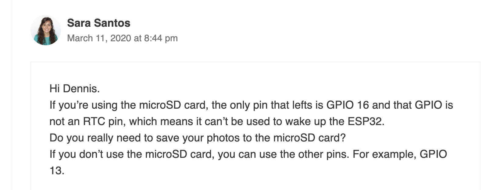
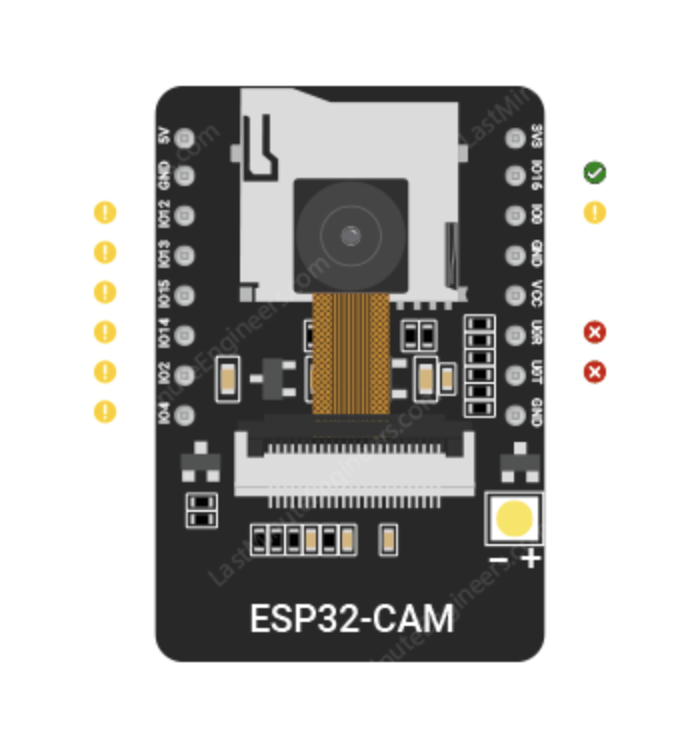
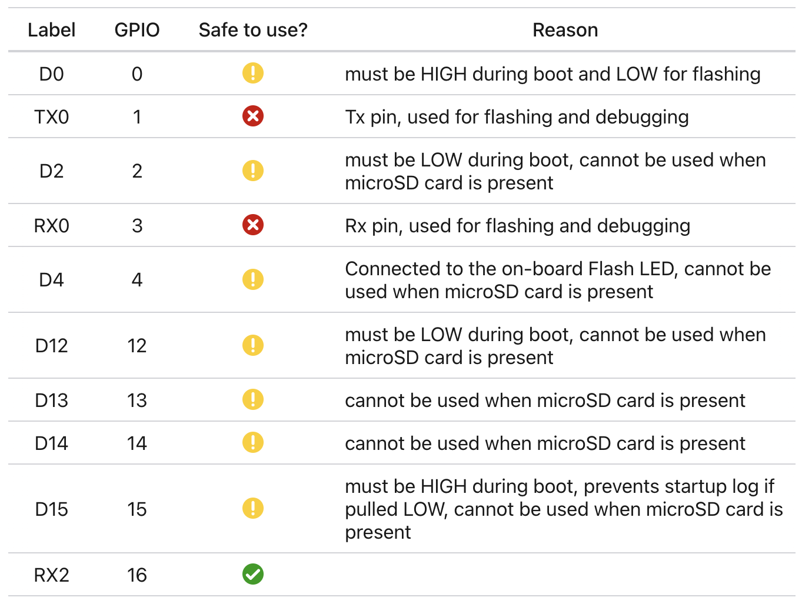

## esp32CamDeepSleep

Deep sleep seems to work properly, although there is one bug where the esp32 turns on and off with pir detection randomly, it still runs the ML model but I suspect it is an interrupt issue with setting PIR as the interrupt. Code logic looks perfectly fine

## esp32camera

~~This is the IR light implemented into one of the GPIOs, currently works but the ML model won't make any detections, in progress of debugging. Seems to be working fine now, ML model seems to be working fine, only thing changed was a data pin for sd card was used so very unsure how that could affect the detections, but after some testing it seems to work fine.~~ Update: images don't save. Possible that IR light might need to be moved to be powered with the Featherboard on boot up. The issue is that we are very limited in gpio pins with the esp32cam

## esp32CamWORKING

This is the working version of esp32cam, doesn't have deep sleep or ir light powered.

## IMAGES

I have tried using GPIO 16 and reboots on a loop

I am using RXD and TXD as GPIO

I tried using 1-bit mode but it doesn't save images, but I got off 1-bit mode and it still doesn't save images

## Pins in use

RXD - Used as GPIO to enable featherboard
TXD - Connected to RX0 to featherboard to send what was captured
Pin 4 - This is tied to LED but I used as input from PIR

https://randomnerdtutorials.com/esp32-cam-pir-motion-detector-photo-capture/
